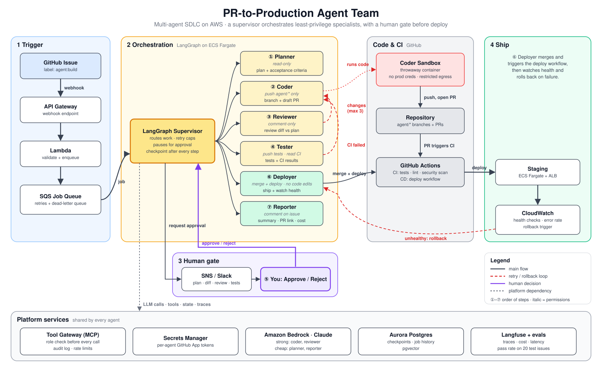

# PR-to-Production Agent Team

An autonomous multi-agent system that transforms GitHub issues into production deployments through supervised collaboration.

## Overview

The PR-to-Production Agent Team implements a complete software delivery workflow using specialized AI agents orchestrated by LangGraph. When a GitHub issue is labeled `agent:build`, the system:

1. **Plans** the implementation approach and estimates complexity
2. **Codes** changes in a sandboxed environment, creating a draft PR on an `agent/*` branch
3. **Reviews** the code for quality and correctness (up to 3 retry loops)
4. **Tests** by generating and running test cases
5. **Awaits approval** at a human-in-the-loop gate with durable checkpointing
6. **Deploys** to staging with health checks and automatic rollback on failure
7. **Reports** results back to the issue with PR link, deploy status, and run cost

Each agent has minimal, role-based permissions enforced through a central tool gateway with full audit logging.

## Architecture



*Figure: Target AWS architecture showing ECS deployment, RDS checkpoints, and EventBridge webhooks. Current implementation runs locally with mocked backends.*

[View full-size PNG](docs/architecture/pr-to-prod-architecture-v3.png)

### Key Components

- **LangGraph Supervisor**: Orchestrates agent execution with conditional routing
- **Tool Gateway**: Enforces RBAC and logs all tool calls for audit
- **Checkpoint Storage**: Persists workflow state to SQLite/Postgres for resumability
- **Sandbox Runner**: Executes untrusted code in isolated Docker containers
- **Mock Backends**: GitHub and LLM mocks for testing without external dependencies

## Current Status

### ✅ What Works Today (Real)

- **Complete workflow execution**: PLAN → CODE → REVIEW → TEST → AWAIT_APPROVAL → DEPLOY → REPORT → COMPLETED
- **LangGraph orchestration**: Supervisor pattern with conditional routing between agents
- **Tool gateway**: Permission enforcement and audit logging for all agent actions
- **Checkpoint persistence**: Resume workflows from approval gates using SQLite or Postgres
- **Docker sandbox**: Secure code execution with network isolation, resource limits, and subprocess fallback
- **Auto-approval mode**: Demo flag for end-to-end testing without manual approval
- **Rollback simulation**: Health check failure triggering automatic rollback
- **51 passing tests**: 40 unit tests + 11 integration/sandbox tests
- **CI pipeline**: GitHub Actions running tests, linting, and type checking

### 🔄 What's Mocked/Simulated

- **GitHub API**: Using `MockGitHubBackend` for repo, PR, and issue operations
- **LLM providers**: Using `MockProvider` instead of real Anthropic/Bedrock API calls
- **Deployments**: Simulated staging deploy with configurable health check outcomes
- **Health checks**: Mock health verification with simulated metrics

### 🚧 Not Yet Implemented

- **Real GitHub API integration**: GitHub tools exist but not wired to live API
- **Real LLM API calls**: Anthropic and Bedrock providers implemented but not used in agents
- **Webhook receiver**: FastAPI webhook server scaffolded but not deployed
- **AWS infrastructure**: CDK/Terraform IaC exists but not deployed to AWS
- **Evaluation harness execution**: Sample issues and eval framework present but not run against real APIs
- **Production deployments**: No integration with real staging/production environments

## Quickstart

### Installation

```bash
# Clone and install dependencies
git clone <repo-url>
cd pr-to-prod-agents
pip install -e .

# Install dev dependencies
pip install -e ".[dev]"
```

### Run Demo (Normal Flow)

Execute the complete workflow with mock backends:

```bash
python3 -m pr_to_prod.cli demo --mock
```

**Output (last 20 lines)**:
```
Demo Workflow Complete!

Final Status: completed
Steps Executed: 7

Workflow Log:
  [2026-09-29T00:33:30.925437+00:00] Plan created with 1 files to change
  [2026-09-29T00:33:30.939217+00:00] Created PR #1
  [2026-09-29T00:33:30.947566+00:00] Review: Approved
  [2026-09-29T00:33:30.957215+00:00] Tests: 2 passed, 0 failed
  [2026-09-29T00:33:30.962536+00:00] Auto-approved in demo mode
  [2026-09-29T00:33:32.975189+00:00] Deployed to staging: Success
  [2026-09-29T00:33:32.979455+00:00] Final report posted to issue

Audit Log:
  [2026-09-29T00:33:30.923277+00:00] ALLOWED - planner called read_repo 
  [2026-09-29T00:33:30.923995+00:00] ALLOWED - planner called search_code 
  [2026-09-29T00:33:30.933523+00:00] ALLOWED - coder called push_branch 
  [2026-09-29T00:33:30.934785+00:00] ALLOWED - coder called read_file 
  [2026-09-29T00:33:30.935441+00:00] ALLOWED - coder called write_file 
  [2026-09-29T00:33:30.937111+00:00] ALLOWED - coder called create_pr 
  [2026-09-29T00:33:30.944071+00:00] ALLOWED - reviewer called read_file 
  [2026-09-29T00:33:30.944822+00:00] ALLOWED - reviewer called comment_pr 
  [2026-09-29T00:33:30.945964+00:00] ALLOWED - reviewer called review_pr 
  [2026-09-29T00:33:30.952574+00:00] ALLOWED - tester called write_file 
```

### Run Demo (Rollback Flow)

Simulate a failed health check to trigger automatic rollback:

```bash
python3 -m pr_to_prod.cli demo --mock --simulate-unhealthy
```

**Output (last 20 lines)**:
```
Demo Workflow Complete!

Final Status: completed
Steps Executed: 7

Workflow Log:
  [2026-09-29T00:33:30.916277+00:00] Plan created with 1 files to change
  [2026-09-29T00:33:30.928930+00:00] Created PR #1
  [2026-09-29T00:33:30.937163+00:00] Review: Approved
  [2026-09-29T00:33:30.946237+00:00] Tests: 2 passed, 0 failed
  [2026-09-29T00:33:30.950943+00:00] Auto-approved in demo mode
  [2026-09-29T00:33:32.963025+00:00] Deployed to staging: Failed
  [2026-09-29T00:33:32.967278+00:00] Final report posted to issue

Audit Log:
  [2026-09-29T00:33:30.914144+00:00] ALLOWED - planner called read_repo 
  [2026-09-29T00:33:30.914814+00:00] ALLOWED - planner called search_code 
  [2026-09-29T00:33:30.923284+00:00] ALLOWED - coder called push_branch 
  [2026-09-29T00:33:30.924421+00:00] ALLOWED - coder called read_file 
  [2026-09-29T00:33:30.925058+00:00] ALLOWED - coder called write_file 
  [2026-09-29T00:33:30.926668+00:00] ALLOWED - coder called create_pr 
  [2026-09-29T00:33:30.933625+00:00] ALLOWED - reviewer called read_file 
  [2026-09-29T00:33:30.934325+00:00] ALLOWED - reviewer called comment_pr 
  [2026-09-29T00:33:30.935433+00:00] ALLOWED - reviewer called review_pr 
  [2026-09-29T00:33:30.941741+00:00] ALLOWED - tester called write_file 
```

### Run Tests

```bash
# Run all tests with coverage
pytest tests/ -v --cov=pr_to_prod --cov-report=term-missing

# Run specific test categories
pytest tests/unit/ -v           # Unit tests only
pytest tests/integration/ -v    # Integration tests only

# Quick test count
pytest tests/ --co -q
```

**Test Summary**:
- **51 tests** (40 unit + 11 integration)
- **58% coverage** (669/1575 lines)
- All tests pass in CI

### Linting and Type Checking

```bash
# Format code
black pr_to_prod tests

# Check formatting
black --check pr_to_prod tests

# Lint
ruff check pr_to_prod tests

# Type check
mypy pr_to_prod --ignore-missing-imports
```

## Repository Layout

```
pr-to-prod-agents/
├── pr_to_prod/
│   ├── agents/          # Six specialized agents (planner, coder, reviewer, tester, deployer, reporter)
│   ├── orchestration/   # LangGraph supervisor workflow with conditional routing
│   ├── tools/           # Tool gateway, GitHub tools, mock backends
│   ├── sandbox/         # Docker sandbox runner with subprocess fallback
│   ├── providers/       # LLM provider interface (Anthropic, Bedrock, Mock)
│   ├── storage/         # Checkpoint persistence (SQLite/Postgres)
│   ├── models.py        # Pydantic models for state, permissions, results
│   ├── config.py        # Settings and environment configuration
│   ├── cli.py           # Typer CLI for demo, run, resume commands
│   └── webhook.py       # FastAPI webhook receiver (not deployed)
├── tests/
│   ├── unit/            # 40 unit tests for components
│   └── integration/     # 11 integration tests for workflows
├── sample-app/          # Example FastAPI app for testing
├── docs/
│   └── architecture/    # Architecture diagrams and documentation
├── infrastructure/      # AWS CDK/Terraform (not deployed)
└── evaluations/         # Evaluation harness and sample issues
```

## Agent Permissions

Each agent has minimal, role-based permissions enforced by the tool gateway:

| Agent | Permissions |
|-------|------------|
| **Planner** | `READ_REPO`, `SEARCH_CODE`, `READ_FILE` |
| **Coder** | `READ_REPO`, `SEARCH_CODE`, `READ_FILE`, `WRITE_FILE`, `PUSH_BRANCH`, `CREATE_PR` |
| **Reviewer** | `READ_REPO`, `READ_FILE`, `COMMENT_PR`, `REVIEW_PR` |
| **Tester** | `READ_REPO`, `READ_FILE`, `WRITE_FILE`, `PUSH_BRANCH`, `READ_CI`, `COMMENT_PR` |
| **Deployer** | `READ_REPO`, `MERGE_PR`, `TRIGGER_DEPLOY`, `READ_HEALTH` |
| **Reporter** | `READ_REPO`, `COMMENT_ISSUE` |

All tool calls are logged with timestamp, agent, tool name, permission, and result for full audit trail.

## Configuration

### Environment Variables

Configure the system using these environment variables (see `.env.example`):

- `ANTHROPIC_API_KEY` - Anthropic API key for Claude models (not used in mock mode)
- `GITHUB_TOKEN` - GitHub personal access token (not used in mock mode)
- `DATABASE_URL` - PostgreSQL connection string (defaults to SQLite)
- `DEFAULT_LLM_PROVIDER` - LLM provider: `mock`, `anthropic`, or `bedrock`
- `DEFAULT_MODEL` - Model name per provider
- `MAX_RETRIES_*` - Retry limits for coder, reviewer, total
- `ENABLE_CHECKPOINTS` - Enable/disable checkpoint persistence

### Agent Models

Override per-agent models via environment variables:
- `AGENT_MODEL_PLANNER`
- `AGENT_MODEL_CODER`
- `AGENT_MODEL_REVIEWER`
- `AGENT_MODEL_TESTER`
- `AGENT_MODEL_DEPLOYER`
- `AGENT_MODEL_REPORTER`

## Roadmap

### Next Steps

1. **Real GitHub API Integration**
   - Wire up `GitHubTools` to live GitHub API
   - Replace `MockGitHubBackend` with real API calls
   - Add OAuth flow for user authentication

2. **Real LLM API Integration**
   - Switch agents from `MockProvider` to `AnthropicProvider` / `BedrockProvider`
   - Add streaming support for long-running generations
   - Implement token tracking and cost monitoring

3. **Webhook Receiver Deployment**
   - Deploy FastAPI webhook server to AWS Lambda or ECS
   - Configure GitHub webhook for issue labeled events
   - Add authentication and request validation

4. **AWS Infrastructure Deployment**
   - Deploy ECS Fargate cluster for agent runners
   - Set up RDS PostgreSQL for checkpoint persistence
   - Configure EventBridge for workflow orchestration
   - Add S3 for artifact storage

5. **Evaluation Harness**
   - Run evaluation against 20 sample issues with real APIs
   - Measure success rates, costs, and execution times
   - Generate evaluation reports and metrics

6. **Production Hardening**
   - Add retries with exponential backoff for API calls
   - Implement circuit breakers for external services
   - Add structured logging and metrics collection
   - Set up monitoring and alerting

## Testing

### Test Structure

- **Unit Tests** (`tests/unit/`): Test individual components in isolation
  - Workflow routing logic
  - Permission enforcement
  - Checkpoint persistence
  - Sandbox execution
  - Rollback behavior

- **Integration Tests** (`tests/integration/`): Test end-to-end workflows
  - Full workflow execution with mocks
  - Step ordering verification
  - PR reuse on retries
  - Approval gate behavior

### Running Tests Locally

```bash
# All tests
pytest tests/ -v

# With coverage report
pytest tests/ --cov=pr_to_prod --cov-report=html

# Specific test file
pytest tests/unit/test_rollback.py -v

# Specific test function
pytest tests/unit/test_sandbox.py::test_docker_runner_executes_command -v
```

### CI Pipeline

GitHub Actions runs on every push:
- **lint**: `black --check` and `ruff check`
- **type-check**: `mypy pr_to_prod --ignore-missing-imports`
- **test**: `pytest tests/ -v --cov=pr_to_prod`
- **sample-app-tests**: `pytest sample-app/tests/`

All checks must pass before merge.

## Development

### Setup Development Environment

```bash
# Create virtual environment
python3 -m venv venv
source venv/bin/activate

# Install in editable mode with dev dependencies
pip install -e ".[dev]"

# Install pre-commit hooks
pre-commit install
```

### Code Quality

This project uses:
- **black** for code formatting (line length 100)
- **ruff** for fast Python linting
- **mypy** for static type checking
- **pytest** for testing with coverage tracking

### Making Changes

1. Create a feature branch from `main`
2. Make your changes with tests
3. Run `black`, `ruff`, and `mypy` locally
4. Ensure all tests pass: `pytest tests/ -v`
5. Push and open a PR
6. Wait for CI checks to pass

## License

[Add license information]

## Contributing

[Add contribution guidelines]

---

**Current Version**: Development (not released)  
**Test Coverage**: 58% (669/1575 lines)  
**Tests**: 51 passing (40 unit, 11 integration)  
**CI Status**: All checks passing
